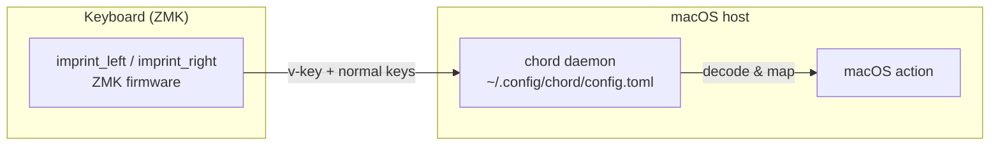

# canon

[日本語](README.md) | **English**

ZMK firmware config (**Cyboard Imprint**, repo root = ZMK user-config).
A split keyboard; ZMK emits dedicated vendor-HID keys (v-keys).

The macOS host-side bridge that decodes those v-keys is a standalone
repo, [`chord`](https://github.com/akira-toriyama/chord) — a Swift 6
CGEventTap daemon driven by `~/.config/chord/config.toml`. This
repository covers only the ZMK side (keymap / firmware build).



## Setup

After cloning, enable the commit-message hook (glyph checks the gitmoji
convention / [CONTRIBUTING.md](https://github.com/akira-toriyama/.github/blob/main/CONTRIBUTING.md)):

```sh
glyph hook install
```

## Layout

```
config/         ZMK keymap / behaviors / combos / west.yml (must stay at root)
build.yaml      4 build targets (imprint_left / imprint_right / imprint_dongle + prospector_scanner)
keymap-drawer/  keymap SVG (auto-generated & committed by the draw-keymap CI)
scripts/        build-zmk.sh (entrypoint), gen-eiji-drawer-map.py, hooks/
docs/           commit convention, etc.
.github/        CI (build / draw / verify-eiji-sync / commit-lint / shellcheck / release)
```

Per ZMK/upstream constraints, `config/` and `build.yaml` must remain at the
repo root (do not move). Every board/shield comes from upstream modules (no
local shields — imprint_dongle is upstreamed to Cyboard). See [CLAUDE.md](CLAUDE.md).

## ZMK firmware build

After editing `config/imprint.keymap` etc., get the `.uf2` via one of the
following. Build targets are in [build.yaml](build.yaml) (`imprint_left` /
`imprint_right` / `imprint_dongle`, plus `prospector_scanner` for the Prospector
Dongle — 4 in total). ZMK itself tracks `main` (required by the
Cyboard module; pinning is not possible — see [CLAUDE.md](CLAUDE.md)).

### GitHub Actions (no local setup)

1. Push the change (or open a PR)
2. GitHub **Actions** tab → open the `Build` run
3. Download `firmware` from the run's **Artifacts** and unzip
4. Flash the `imprint_left` / `imprint_right` `.uf2` to each half

### Local (Docker)

```sh
./scripts/build-zmk.sh                 # all targets in build.yaml (=all)
./scripts/build-zmk.sh imprint         # the 3 imprint targets (without prospector_scanner)
./scripts/build-zmk.sh imprint_left    # a specific shield
./scripts/build-zmk.sh prospector_scanner  # the Prospector Dongle only
./scripts/build-zmk.sh --update        # refresh deps (west update)
./scripts/build-zmk.sh --clean         # drop the cached workspace
```

- Output: **`firmware/imprint_left.uf2`** / **`firmware/imprint_right.uf2`** /
  `firmware/imprint_dongle.uf2` / `firmware/prospector_scanner.uf2` (git-ignored)
- Requires Docker. Deps persist in `~/.cache/zmk-canon` (fast after the
  first run)

### Flash

Copy the built `.uf2` onto the device's bootloader volume (double-tap reset to
mount it). `scripts/flash-watch.sh` watches `/Volumes` and copies in order
(1st assimilator-bt mount → left, 2nd → right, XIAO mount → dongle), then exits
once all three are done. To wipe NVS first, build `*_RESET.uf2` with
`./scripts/build-zmk.sh imprint --reset` and use `scripts/flash-reset.sh`; the
re-pairing procedure is in [docs/dongle-roadmap.md](docs/dongle-roadmap.md).

### Prospector Dongle (companion status display)

Flashing `prospector_scanner.uf2` onto a
[Prospector](https://shop.beekeeb.com/products/pre-soldered-prospector-zmk-dongle)
(XIAO nRF52840 + 1.69" LCD) turns it into a display for what the Imprint Dongle
broadcasts over BLE advertising: the active layer, both halves' battery levels,
modifiers and WPM. It never pairs or connects (observer only). It appears on
the Mac only as one CDC serial port (product `Prospector Dongle`, no HID
keyboard; seen on hardware 2026-09-26), and that port exists so that
opening it at 1200 baud enters the bootloader. The Imprint Dongle must run this
repository's `imprint_dongle.uf2`, which carries the status advertisement.

Flashing (not with `flash-watch.sh`):

- Normally `./scripts/flash-prospector.sh` (default
  `firmware/prospector_scanner.uf2`): it opens the port at 1200 baud to enter
  the bootloader, copies with `cp -X` and waits for the device to re-enumerate
  (two runs in a row on hardware 2026-09-26, about 8 s each). Check the
  display yourself.
- The first time, coming from the USB power-only image that predates the
  1200 baud entry, and whenever the script fails, flash by hand:
  1. Double-tap the Prospector Dongle's reset → `/Volumes/XIAO-SENSE` mounts
  2. `cp -X firmware/prospector_scanner.uf2 /Volumes/XIAO-SENSE/` (a trailing
     `fcopyfile failed: Input/output error` means the write finished and the
     device rebooted)
  3. Once it re-enumerates it picks up the advertisement and shows the Imprint
     Dongle's status, provided the Imprint Dongle is running

**It shares the `XIAO-SENSE` bootloader with the Imprint Dongle**: never put
both dongles into bootloader at the same time, and never put the Prospector
Dongle into bootloader or open its port at 1200 baud while `flash-watch.sh` /
`flash-reset.sh` is running (those copy `imprint_dongle.uf2` onto any XIAO
mount; `flash-prospector.sh` refuses to start then).

`config/prospector_scanner.conf` targets beekeeb's pre-soldered unit (no ambient
light sensor, touch panel unwired): fixed 80% brightness, touch off. The layout
is chosen with `CONFIG_PROSPECTOR_DEFAULT_LAYOUT` (no touch, so the conf value
is the only selector).

### Release

Every merge to `main` updates a rolling **draft** Release: glyph computes the
next version and the notes (squash-safe) and attaches `imprint_*.uf2` and
`prospector_scanner.uf2`. Publish
the draft manually after review — the `vX.Y.Z` tag is created at publish time
([CONTRIBUTING.md](https://github.com/akira-toriyama/.github/blob/main/CONTRIBUTING.md)).

## keymap

<details>
<summary>Show keymap diagram</summary>


</details>

The keymap is [`config/imprint.keymap`](config/imprint.keymap) (each `*.dtsi`
is `#include`d). The EIJI (Japanese romaji input) layer is generated by
`scripts/gen-eiji-drawer-map.py` from a single source,
[`config/eiji_macros.dtsi`](config/eiji_macros.dtsi); CI verifies they stay in
sync.

The four thumb layers + X_1 are emitted as **vendor-HID v-keys**
(`&vkey <id>`) on a dedicated HID usage page that can't collide with any real
keystroke; the macOS-side [`chord`](https://github.com/akira-toriyama/chord)
bridge maps them to actions. The id→name table
[`config/vkey-aliases.toml`](config/vkey-aliases.toml) is generated by
`scripts/gen-vkey-aliases.py` from the `&vkey <id>` ids in the keymap (the
single source) and checked in CI
([verify-vkey-sync.yml](.github/workflows/verify-vkey-sync.yml)); see
[CLAUDE.md](CLAUDE.md).

## Development & License

- Commits: **gitmoji + Conventional Commits**
  ([CONTRIBUTING.md](https://github.com/akira-toriyama/.github/blob/main/CONTRIBUTING.md))
- License: [MIT](LICENSE) © 2026 akira-toriyama
