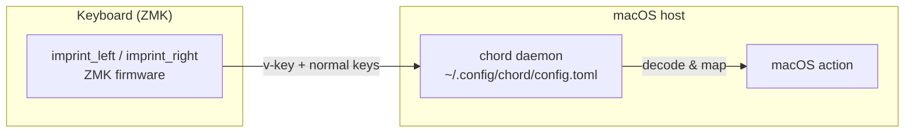

# canon

[日本語](README.md) | **English**

ZMK firmware config (**Cyboard Imprint**, repo root = ZMK user-config).
A split keyboard; ZMK emits dedicated vendor-HID keys (v-keys).

The macOS host-side bridge that decodes those v-keys is a standalone
repo, [`chord`](https://github.com/akira-toriyama/chord) — a Swift 6
CGEventTap daemon driven by `~/.config/chord/config.toml`. This
repository covers only the ZMK side (keymap / firmware build).



## Setup

After cloning, enable the commit-message hook (enforces gitmoji +
Conventional Commits / [CONTRIBUTING.md](https://github.com/akira-toriyama/.github/blob/main/CONTRIBUTING.md)):

```sh
git config core.hooksPath scripts/hooks
```

## Layout

```
config/         ZMK keymap / behaviors / combos / west.yml (must stay at root)
build.yaml      3 build targets (imprint_left / imprint_right / imprint_dongle)
boards/ zephyr/  ZMK board-root (only local shield is imprint_dongle; others come from modules)
keymap-drawer/  keymap SVG (auto-generated & committed by the draw-keymap CI)
scripts/        build-zmk.sh (entrypoint), gen-eiji-drawer-map.py, hooks/
docs/           commit convention, etc.
.github/        CI (build / draw / verify-eiji-sync / commit-lint / shellcheck / release)
```

Per ZMK/upstream constraints, `config/`, `boards/`, `zephyr/module.yml` and
`build.yaml` must remain at the repo root (do not move). See [CLAUDE.md](CLAUDE.md).

## ZMK firmware build

After editing `config/imprint.keymap` etc., get the `.uf2` via one of the
following. Build targets are in [build.yaml](build.yaml) (`imprint_left` /
`imprint_right` / `imprint_dongle` — 3 in total). ZMK itself tracks `main` (required by the
Cyboard module; pinning is not possible — see [CLAUDE.md](CLAUDE.md)).

### GitHub Actions (no local setup)

1. Push the change (or open a PR)
2. GitHub **Actions** tab → open the `Build` run
3. Download `firmware` from the run's **Artifacts** and unzip
4. Flash the `imprint_left` / `imprint_right` `.uf2` to each half

### Local (Docker)

```sh
./scripts/build-zmk.sh                 # all targets in build.yaml (=all)
./scripts/build-zmk.sh imprint         # all imprint targets (= all)
./scripts/build-zmk.sh imprint_left    # a specific shield
./scripts/build-zmk.sh --update        # refresh deps (west update)
./scripts/build-zmk.sh --clean         # drop the cached workspace
```

- Output: **`firmware/imprint_left.uf2`** / **`firmware/imprint_right.uf2`**
  (git-ignored)
- Requires Docker. Deps persist in `~/.cache/zmk-canon` (fast after the
  first run)

### Release

Every merge to `main` updates a rolling **draft** Release: glyph computes the
next version and the notes (squash-safe) and attaches `imprint_*.uf2`. Publish
the draft manually after review — the `vX.Y.Z` tag is created at publish time
([CONTRIBUTING.md](https://github.com/akira-toriyama/.github/blob/main/CONTRIBUTING.md)).

## keymap

<details>
<summary>Show keymap diagram</summary>


</details>

The keymap is [`config/imprint.keymap`](config/imprint.keymap) (each `*.dtsi`
is `#include`d). The EIJI (Japanese romaji input) layer is generated by
`scripts/gen-eiji-drawer-map.py` from a single source,
[`config/eiji_macros.dtsi`](config/eiji_macros.dtsi); CI verifies they stay in
sync.

The four thumb layers + X_1 are emitted as **vendor-HID v-keys**
(`&vkey <id>`) on a dedicated HID usage page that can't collide with any real
keystroke; the macOS-side [`chord`](https://github.com/akira-toriyama/chord)
bridge maps them to actions. The id→name table
[`config/vkey-aliases.toml`](config/vkey-aliases.toml) is generated by
`scripts/gen-vkey-aliases.py` from the `&vkey <id>` ids in the keymap (the
single source) and checked in CI
([verify-vkey-sync.yml](.github/workflows/verify-vkey-sync.yml)); see
[CLAUDE.md](CLAUDE.md).

## Development & License

- Commits: **gitmoji + Conventional Commits**
  ([CONTRIBUTING.md](https://github.com/akira-toriyama/.github/blob/main/CONTRIBUTING.md))
- License: [MIT](LICENSE) © 2026 akira-toriyama
