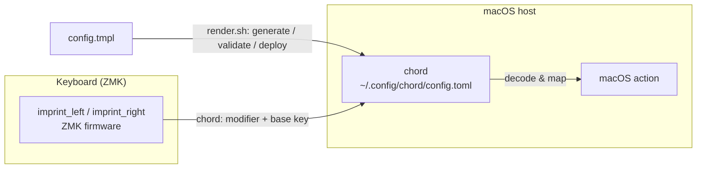
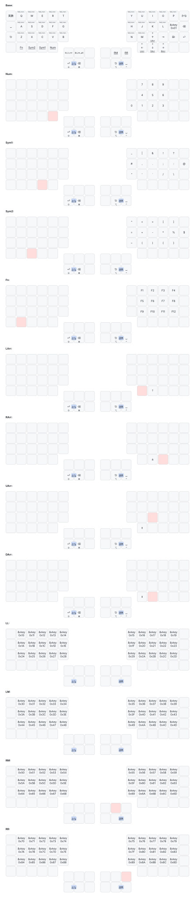

# capsule-corp

[日本語](README.md) | **English**

Monorepo for input-device configuration.

- **Cyboard Imprint** — ZMK firmware config (repo root = ZMK user-config).
  A split keyboard; ZMK emits modifier-combination chords.
- **chord** — macOS host-side bridge ([`host/chord/`](host/chord/)). Chords sent
  by ZMK are received by [akira-toriyama/chord](https://github.com/akira-toriyama/chord)
  (CGEventTap / Swift 6 / TOML config) and translated into macOS actions. F13–F24,
  mouse buttons and scroll wheel are bindable too (the motivation for migrating
  off skhd.zig).

ZMK sends a chord of a modifier key + a base key; chord on the host decodes it.
The modifiers are assigned with super / hyper / meta in mind.
[`host/chord/render.sh`](host/chord/render.sh) bridges the two by generating,
validating and deploying `config.toml` from a template.



## Setup

After cloning, enable the commit-message hook (enforces gitmoji +
Conventional Commits / [docs/commit-convention.md](docs/commit-convention.md)):

```sh
git config core.hooksPath scripts/hooks
```

## Layout

```
config/         ZMK keymap / behaviors / combos / west.yml (must stay at root)
build.yaml      Build targets (assimilator-bt × imprint_left / imprint_right)
boards/ zephyr/  ZMK board-root (board/shield come from the Cyboard module; empty is normal)
keymap-drawer/  keymap SVG (auto-generated & committed by the draw-keymap CI)
host/chord/     macOS chord bridge (render.sh, config.tmpl, render-vars.sh)
scripts/        build-zmk.sh / render-chord.sh (entrypoints), gen-eiji-drawer-map.py, hooks/
docs/           commit convention, etc.
.github/        CI (build / draw / verify-eiji-sync / verify-chord-doc / commit-lint / shellcheck / release)
```

Per ZMK/upstream constraints, `config/`, `boards/`, `zephyr/module.yml` and
`build.yaml` must remain at the repo root (do not move). See [CLAUDE.md](CLAUDE.md).

## ZMK firmware build

After editing `config/imprint.keymap` etc., get the `.uf2` via one of the
following. Build targets are in [build.yaml](build.yaml) (`assimilator-bt` ×
`imprint_left` / `imprint_right`). ZMK itself tracks `main` (required by the
Cyboard module; pinning is not possible — see [CLAUDE.md](CLAUDE.md)).

### GitHub Actions (no local setup)

1. Push the change (or open a PR)
2. GitHub **Actions** tab → open the `Build` run
3. Download `firmware` from the run's **Artifacts** and unzip
4. Flash the `imprint_left` / `imprint_right` `.uf2` to each half

### Local (Docker)

```sh
./scripts/build-zmk.sh                 # all targets in build.yaml
./scripts/build-zmk.sh imprint_left    # a specific shield
./scripts/build-zmk.sh --update        # refresh deps (west update)
./scripts/build-zmk.sh --clean         # drop the cached workspace
```

- Output: **`firmware/imprint_left.uf2`** / **`firmware/imprint_right.uf2`**
  (git-ignored)
- Requires Docker. Deps persist in `~/.cache/zmk-capsule-corp` (fast after the
  first run)

### Release

Run the **Release** workflow manually → the next version is computed from
commits; it creates a `vX.Y.Z` tag and a GitHub Release (git-cliff-generated
notes + `imprint_*.uf2`) ([docs/commit-convention.md](docs/commit-convention.md)).
CHANGELOG is not auto-pushed to `main` (branch protection is respected).

## chord

```sh
./scripts/render-chord.sh   # generate → validate → deploy to ~/.config/chord/config.toml & reload
```

Location-independent. Only a config that passes `chord --validate` is deployed,
so the running `config.toml` is never broken (when `chord` is not installed
yet, validation is skipped but the file is still deployed — install first, then
chord auto-reloads via its vnode watcher).

Shortcut reference, modifier sets and update steps:
[host/chord/README.md](host/chord/README.md).

## keymap

<details>
<summary>Show keymap diagram</summary>



</details>

The keymap is [`config/imprint.keymap`](config/imprint.keymap) (each `*.dtsi`
is `#include`d). The EIJI (Japanese romaji input) layer is generated by
`scripts/gen-eiji-drawer-map.py` from a single source,
[`config/eiji_macros.dtsi`](config/eiji_macros.dtsi); CI verifies they stay in
sync.

## Development & License

- Commits: **gitmoji + Conventional Commits**
  ([docs/commit-convention.md](docs/commit-convention.md))
- License: [MIT](LICENSE) © 2026 akira-toriyama
