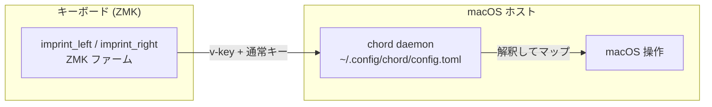

# canon

**日本語** | [English](README.en.md)

ZMK ファームウェア設定（**Cyboard Imprint**、リポジトリルート = ZMK
user-config）。分割キーボード。ZMK が専用の vendor-HID キー（v-key）を送出する。

ZMK が送る v-key を macOS 側で受けるホストブリッジは独立リポジトリ
[`chord`](https://github.com/akira-toriyama/chord)（Swift 6 / CGEventTap
デーモン、`~/.config/chord/config.toml` 駆動）。本リポジトリは ZMK 側
（キーマップ・ファームウェアビルド）のみを扱う。



## 環境構築

クローン後、コミットメッセージ検証フックを有効化する（gitmoji 規約を
glyph が検証 / [CONTRIBUTING.md](https://github.com/akira-toriyama/.github/blob/main/CONTRIBUTING.md)）。

```sh
glyph hook install
```

## ディレクトリ構成

```
config/         ZMK キーマップ / behaviors / combos / west.yml（ルート必須）
build.yaml      ビルド対象 4 つ（imprint_left / imprint_right / imprint_dongle + prospector_scanner）
keymap-drawer/  keymap 図 SVG（draw-keymap CI が自動生成・コミット）
scripts/        build-zmk.sh（エントリ）, gen-eiji-drawer-map.py, hooks/
docs/           コミット規約ほか
.github/        CI（build / draw / verify-eiji-sync / commit-lint / shellcheck / release）
```

ZMK と上流ツールの制約で `config/` `build.yaml` はリポジトリルート固定
（移動しない）。board / shield はすべて upstream module 提供（ローカル shield
無し — imprint_dongle も Cyboard 上流入り済み）。詳細は [CLAUDE.md](CLAUDE.md)。

## ZMK ファーム ビルド

`config/imprint.keymap` 等を変更したら、以下のいずれかで `.uf2` を得る。
ビルド対象は [build.yaml](build.yaml)（`imprint_left` / `imprint_right` /
`imprint_dongle` の 3 つ + Prospector Dongle 用 `prospector_scanner`）。ZMK 本体は
`main` 追従（Cyboard モジュールが要求。タグ固定
不可。詳細 [CLAUDE.md](CLAUDE.md)）。

### GitHub Actions（環境構築不要）

1. 変更を push（または PR を作成）
2. GitHub の **Actions** タブ → 対象の `Build` run を開く
3. run 下部の **Artifacts** から `firmware` を DL して解凍
4. 中の `imprint_left` / `imprint_right` の `.uf2` を各ハーフへ書き込む

### ローカル（Docker）

```sh
./scripts/build-zmk.sh                 # build.yaml の全ターゲット（=all）
./scripts/build-zmk.sh imprint         # imprint の 3 ターゲット（prospector_scanner を除く）
./scripts/build-zmk.sh imprint_left    # シールド指定
./scripts/build-zmk.sh prospector_scanner  # Prospector Dongle のみ
./scripts/build-zmk.sh --update        # 依存を最新化（west update）
./scripts/build-zmk.sh --clean         # キャッシュ破棄
```

- 出力先: **`firmware/imprint_left.uf2`** / **`firmware/imprint_right.uf2`** /
  `firmware/imprint_dongle.uf2` / `firmware/prospector_scanner.uf2`（`.gitignore` 済）
- 要 Docker。依存は `~/.cache/zmk-canon` に永続化（2 回目以降は高速）

### フラッシュ

ビルドした `.uf2` をブートローダ（リセット2回でマウント）へコピーする。
`scripts/flash-watch.sh` が `/Volumes` を監視して順に自動コピーする
（assimilator-bt 1台目→左 / 2台目→右 / XIAO BLE→dongle）。3台焼けたら終了。

NVS をリセットして焼く場合は `./scripts/build-zmk.sh imprint --reset` で
`*_RESET.uf2` を作り `scripts/flash-reset.sh`。再ペアリング復旧手順は
[docs/dongle-roadmap.md](docs/dongle-roadmap.md)。

### Prospector Dongle（状態表示の companion）

[Prospector](https://shop.beekeeb.com/products/pre-soldered-prospector-zmk-dongle)
（XIAO nRF52840 + 1.69" LCD）に `prospector_scanner.uf2` を焼くと、Imprint Dongle が
BLE 広告で流す状態（layer・左右半体の電池・modifier・WPM）を表示する。ペアリングも
接続も不要（observer のみ）で、USB-C は給電だけ（USB スタックを切っているので Mac に
USB 機器としては現れない。BLE 側は ZMK の都合で "Prospector" の connectable 広告が
残る＝ペアリング候補には見えるが、繋がなければ無害）。Imprint Dongle 側は本リポジトリの
`imprint_dongle.uf2`（status advertisement 入り）であること。

焼き方は手動（`flash-watch.sh` は使わない）:

1. Prospector Dongle のリセットをダブルタップ → `/Volumes/XIAO-SENSE` がマウント
2. `cp -X firmware/prospector_scanner.uf2 /Volumes/XIAO-SENSE/`（末尾の
   `fcopyfile failed: Input/output error` は書き込み完了で再起動した合図）
3. 再列挙後、Imprint Dongle が動いていれば広告を拾って表示が始まる

**Imprint Dongle と同じ `XIAO-SENSE` ブートローダ**なので、2 台を同時にブートローダへ
入れない。`flash-watch.sh` / `flash-reset.sh` は XIAO を見ると `imprint_dongle.uf2` を
焼くため、実行中は Prospector Dongle をブートローダに入れない。

`config/prospector_scanner.conf` は beekeeb の pre-soldered 版（環境光センサー無し・
touch 未配線）向け: 明るさ固定 80%・touch 無効。layout は
`CONFIG_PROSPECTOR_DEFAULT_LAYOUT` で選ぶ（touch が無いので conf の値が唯一の選択手段）。
既定は 1=Field: 現在 layer の名前を大きく、左右半体の電池、modifier、WPM 連動の演出。
layer 名は広告の 4 byte 制約で先頭 4 文字・大文字になる。

### リリース

main へマージするたび、Actions の **Release** が glyph で次版とノートを算出し
「ローリングドラフト」Release を更新する（`imprint_*.uf2` と `prospector_scanner.uf2` を添付）。内容確認の
うえ手動 Publish した時点で `vX.Y.Z` タグが生成される
（[CONTRIBUTING.md](https://github.com/akira-toriyama/.github/blob/main/CONTRIBUTING.md)）。

## keymap

<details>
<summary>キーマップ図を表示</summary>


</details>

キーマップは [`config/imprint.keymap`](config/imprint.keymap)（各 `*.dtsi` を
`#include`）。EIJI（英字入力）レイヤーは
[`config/eiji_macros.dtsi`](config/eiji_macros.dtsi) を単一ソースとして
`scripts/gen-eiji-drawer-map.py` が生成し、CI で同期を検証する。

サム 4 層 + X_1 は **vendor-HID v-key**（`&vkey <id>`）で送出する。既存の
どのキー入力とも衝突しない専用 HID usage page を使い、macOS 側
[`chord`](https://github.com/akira-toriyama/chord) が受けて action にマップする。
id→論理名の対応表 [`config/vkey-aliases.toml`](config/vkey-aliases.toml) は
キーマップの `&vkey <id>` を単一ソースに `scripts/gen-vkey-aliases.py` が生成し、
CI（[verify-vkey-sync.yml](.github/workflows/verify-vkey-sync.yml)）で照合する
（詳細は [CLAUDE.md](CLAUDE.md)）。

## 開発・ライセンス

- コミット規約: **gitmoji + Conventional Commits**（[CONTRIBUTING.md](https://github.com/akira-toriyama/.github/blob/main/CONTRIBUTING.md)）
- ライセンス: [MIT](LICENSE) © 2026 akira-toriyama
