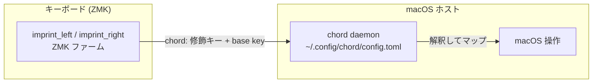

# canon

**日本語** | [English](README.en.md)

ZMK ファームウェア設定（**Cyboard Imprint**、リポジトリルート = ZMK
user-config）。分割キーボード。修飾キーの組み合わせ（chord）を ZMK が送出する。

ZMK が送る chord を macOS 側で受けるホストブリッジは独立リポジトリ
[`chord`](https://github.com/akira-toriyama/chord)（Swift 6 / CGEventTap
デーモン、`~/.config/chord/config.toml` 駆動）。本リポジトリは ZMK 側
（キーマップ・ファームウェアビルド）のみを扱う。



## 環境構築

クローン後、コミットメッセージ検証フックを有効化する（gitmoji +
Conventional Commits を強制 / [docs/commit-convention.md](docs/commit-convention.md)）。

```sh
git config core.hooksPath scripts/hooks
```

## ディレクトリ構成

```
config/         ZMK キーマップ / behaviors / combos / west.yml（ルート必須）
build.yaml      ビルド対象 4 つ（imprint_left/right/dongle + ist の ble_hid_host_receiver）
boards/ zephyr/  ZMK board-root（ボード/シールドは Cyboard モジュール由来。空で正常）
keymap-drawer/  keymap 図 SVG（draw-keymap CI が自動生成・コミット）
scripts/        build-zmk.sh（エントリ）, gen-eiji-drawer-map.py, hooks/
docs/           コミット規約ほか
.github/        CI（build / draw / verify-eiji-sync / commit-lint / shellcheck / release）
```

ZMK と上流ツールの制約で `config/` `boards/` `zephyr/module.yml` `build.yaml`
はリポジトリルート固定（移動しない）。詳細は [CLAUDE.md](CLAUDE.md)。

## ZMK ファーム ビルド

`config/imprint.keymap` 等を変更したら、以下のいずれかで `.uf2` を得る。
ビルド対象は [build.yaml](build.yaml)（imprint の `imprint_left` / `imprint_right` /
`imprint_dongle` + ist 受信ドングル `ble_hid_host_receiver` の 4 つ）。ZMK 本体は
`main` 追従（Cyboard モジュールが要求。タグ固定
不可。詳細 [CLAUDE.md](CLAUDE.md)）。

### GitHub Actions（環境構築不要）

1. 変更を push（または PR を作成）
2. GitHub の **Actions** タブ → 対象の `Build` run を開く
3. run 下部の **Artifacts** から `firmware` を DL して解凍
4. 中の `imprint_left` / `imprint_right` の `.uf2` を各ハーフへ書き込む

### ローカル（Docker）

```sh
./scripts/build-zmk.sh                 # build.yaml の全ターゲット（=all）
./scripts/build-zmk.sh imprint         # 製品グループ（imprint だけ / ist だけ）
./scripts/build-zmk.sh imprint_left    # シールド指定
./scripts/build-zmk.sh --update        # 依存を最新化（west update）
./scripts/build-zmk.sh --clean         # キャッシュ破棄
```

- 出力先: **`firmware/imprint_left.uf2`** / **`firmware/imprint_right.uf2`**
  （`.gitignore` 済）
- 要 Docker。依存は `~/.cache/zmk-canon` に永続化（2 回目以降は高速）

### リリース

Actions の **Release** を手動起動 → コミットから次版を算出し、`vX.Y.Z`
タグ＋GitHub Release（git-cliff 生成ノート＋`imprint_*.uf2` 添付）を生成
（[docs/commit-convention.md](docs/commit-convention.md)）。`main` 保護尊重の
ため CHANGELOG は main へ自動 push しない。

## keymap

<details>
<summary>キーマップ図を表示</summary>


</details>

キーマップは [`config/imprint.keymap`](config/imprint.keymap)（各 `*.dtsi` を
`#include`）。EIJI（英字入力）レイヤーは
[`config/eiji_macros.dtsi`](config/eiji_macros.dtsi) を単一ソースとして
`scripts/gen-eiji-drawer-map.py` が生成し、CI で同期を検証する。

サム 4 層 + X_1 は **vendor-HID v-key**（`&vkey <id>`）で送出する。既存の
どのキー入力とも衝突しない専用 HID usage page を使い、macOS 側
[`chord`](https://github.com/akira-toriyama/chord) が受けて action にマップする。
id→論理名の対応表 [`config/vkey-aliases.toml`](config/vkey-aliases.toml) は
キーマップの `&vkey <id>` を単一ソースに `scripts/gen-vkey-aliases.py` が生成し、
CI（[verify-vkey-sync.yml](.github/workflows/verify-vkey-sync.yml)）で照合する
（詳細は [CLAUDE.md](CLAUDE.md)）。

## 開発・ライセンス

- コミット規約: **gitmoji + Conventional Commits**（[docs/commit-convention.md](docs/commit-convention.md)）
- ライセンス: [MIT](LICENSE) © 2026 akira-toriyama
