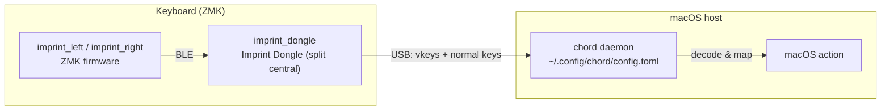
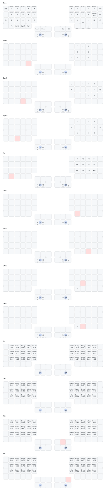

# canon

ZMK firmware config (**Cyboard Imprint**, repo root = ZMK user-config).
A split keyboard; ZMK emits dedicated vendor-HID keys (vkeys).

The macOS host bridge that decodes those vkeys is a standalone
repo, [`chord`](https://github.com/akira-toriyama/chord) — a Swift 6
CGEventTap daemon driven by `~/.config/chord/config.toml`. This
repository covers only the ZMK side (keymap / firmware build).


```mermaid
flowchart LR
  subgraph KB["Keyboard (ZMK)"]
    FW["imprint_left / imprint_right<br/>ZMK firmware"]
    DONGLE["imprint_dongle<br/>Imprint Dongle (split central)"]
  end
  subgraph MAC["macOS host"]
    CHORD["chord daemon<br/>~/.config/chord/config.toml"]
    ACT["macOS action"]
  end
  FW -->|"BLE"| DONGLE
  DONGLE -->|"USB: vkeys + normal keys"| CHORD
  CHORD -->|"decode & map"| ACT
```

## Setup

After cloning, enable glyph's commit-msg and pre-push hooks (glyph checks the gitmoji
convention / [CONTRIBUTING.md](https://github.com/akira-toriyama/.github/blob/main/CONTRIBUTING.md)):

```sh
glyph hook install
```

## Layout

```
config/         ZMK keymap / behaviors / combos / west.yml (must stay at root)
build.yaml      4 build targets (imprint_left / imprint_right / imprint_dongle + prospector)
keymap-drawer/  keymap SVG (auto-generated & committed by the draw-keymap CI)
scripts/        build-zmk.sh (entrypoint), zmk-west.sh, flash-*.sh, dongle.py, gen-*.py
docs/           commit convention, glossary, pairing recovery
.github/        CI (build / draw / verify-eiji-sync / verify-vkey-sync / commit-lint / shellcheck / release)
```

Per ZMK/upstream constraints, `config/` and `build.yaml` must remain at the
repo root (do not move). Every board/shield comes from a module (no local
shields: imprint_dongle is upstreamed to Cyboard, and the Prospector Dongle's
shield lives in [zmk-beacon](https://github.com/akira-toriyama/zmk-beacon)). See [CLAUDE.md](CLAUDE.md).

## ZMK firmware build

After editing `config/imprint.keymap` etc., get the `.uf2` via one of the
following. Build targets are in [build.yaml](build.yaml) (`imprint_left` /
`imprint_right` / `imprint_dongle`, plus `prospector` for the Prospector
Dongle — 4 in total). ZMK itself tracks `main` (required by the
Cyboard module; pinning a release tag is not possible — see [CLAUDE.md](CLAUDE.md)).

### GitHub Actions (no local setup)

1. Open a PR with the change (a push to a branch without a PR does not build)
2. GitHub **Actions** tab → open the `Build` run
3. Download the run's **Artifacts**, one per target (`imprint_left`,
   `imprint_right`, `imprint_dongle`, `prospector`), and unzip them
4. Flash `imprint_left.uf2` / `imprint_right.uf2` to each half,
   `imprint_dongle.uf2` to the Imprint Dongle and `prospector.uf2` to the
   Prospector Dongle (see Flash below)

### Local (Docker)

```sh
./scripts/build-zmk.sh                 # all targets in build.yaml (=all)
./scripts/build-zmk.sh imprint         # the 3 imprint targets (without prospector)
./scripts/build-zmk.sh imprint_left    # a specific shield
./scripts/build-zmk.sh prospector     # the Prospector Dongle only
./scripts/build-zmk.sh prospector --sprite assets/<name>.gif  # with a GIF animation (local only)
./scripts/build-zmk.sh --update        # west update, then build all targets
./scripts/build-zmk.sh --clean         # drop the cached workspace
```

- Output: **`firmware/imprint_left.uf2`** / **`firmware/imprint_right.uf2`** /
  `firmware/imprint_dongle.uf2` / `firmware/prospector.uf2`, one per target
  built (git-ignored); the `--sprite` build writes
  `firmware/prospector-sprite.uf2` instead
- Requires Docker. Deps persist in `~/.cache/zmk-canon` (fast after the
  first run)

### Flash

Copy the built `.uf2` onto the device's bootloader volume (double-tap reset to
mount it; a single tap only reboots: a normal image keeps the bonds, a
`*_RESET.uf2` erases them at every boot). `scripts/flash-watch.sh`
watches `/Volumes` and copies in order (1st assimilator-bt mount → left, 2nd →
right, XIAO mount → Imprint Dongle), then exits once all three are done. To
wipe NVS (every BLE bond and setting, on all three devices) first, build
`*_RESET.uf2` with `./scripts/build-zmk.sh imprint --reset` and use
`scripts/flash-reset.sh`; the re-pairing procedure is in
[docs/recovery.md](docs/recovery.md).

The Imprint Dongle (images from 2026-09-27 on) also enters the bootloader when
its CDC port is opened at 1200 baud, the Prospector Dongle's mechanism, so
`flash-dongle.sh` needs no double-tap except the first time, coming from an
image without that entry; `flash-watch.sh` / `flash-reset.sh` and a failed
`flash-dongle.sh` run take it by double-tap (by hand:
[docs/recovery.md](docs/recovery.md)). Claude Code flashes it with `./scripts/flash-dongle.sh imprint_dongle`, which
finds the port by the product string `Imprint Dongle` and copies with `cp -X`
only after checking that the mounted `XIAO-SENSE` carries the Imprint Dongle's
USB location. Never open
either dongle's port at 1200 baud while `flash-watch.sh` / `flash-reset.sh`
runs.

### Prospector Dongle (companion status display)

Flashing `prospector.uf2` onto a
[Prospector](https://shop.beekeeb.com/products/pre-soldered-prospector-zmk-dongle)
(XIAO nRF52840 + 1.69" LCD) turns it into a display of both halves' battery
levels, received from the Imprint Dongle's BLE status advertisement: one HP bar
showing their mean (or the one half that has a reading), yellow under 50 % and
red under 20 %. It only listens: it
never advertises, pairs or connects (a Mac's BLE scan saw no advertisement from
it, 2026-09-26). It appears on the Mac only as
one CDC serial port (product `Prospector Dongle`, no HID keyboard; seen on
hardware 2026-09-26), and that port is how it is reflashed (1200 baud enters
the bootloader), how `python3 scripts/dongle.py shot` reads its screen (2400
baud) and, in a logging build, where its log goes. The Imprint Dongle must run this repository's
`imprint_dongle.uf2`, which carries the status advertisement. The shield and
its screen come from [zmk-beacon](https://github.com/akira-toriyama/zmk-beacon),
whose README explains what the screen shows.

Flashing (not with `flash-watch.sh`):

- Normally `./scripts/flash-dongle.sh prospector`
  (`firmware/prospector.uf2`): it opens the port at 1200 baud to enter
  the bootloader, copies with `cp -X` and waits for the device to re-enumerate
  (two runs in a row on hardware 2026-09-26, about 8 s each; the copy of a
  new image alone took about 24 s the same day). Check the display yourself.
- The first time, coming from the USB power-only image that predates the
  1200 baud entry, and whenever the script fails, flash by hand:
  1. Double-tap the Prospector Dongle's reset → `/Volumes/XIAO-SENSE` mounts
  2. `cp -X firmware/prospector.uf2 /Volumes/XIAO-SENSE/` (a trailing
     `fcopyfile failed: Input/output error` is usual as the bootloader
     reboots under the copy, but proves nothing alone: step 3 is the check)
  3. Once it re-enumerates it picks up the advertisement and shows both
     halves' battery, provided the Imprint Dongle is running

**It shares the `XIAO-SENSE` bootloader with the Imprint Dongle**: never put
both dongles into bootloader at the same time, and never put the Prospector
Dongle into bootloader or open its port at 1200 baud while `flash-watch.sh` /
`flash-reset.sh` is running (those copy `imprint_dongle.uf2`, or
`imprint_dongle_RESET.uf2`, onto any XIAO mount; `flash-dongle.sh` refuses to
start then).

zmk-beacon's shield targets beekeeb's pre-soldered unit (no ambient light
sensor, touch panel unwired): 80% brightness, no touch. The screen turns off
after five minutes without a key press and lights at the next one (zmk-beacon's
`CONFIG_BEACON_SCREEN_OFF_AFTER_S`, default 300 seconds; 0 keeps it lit).
`config/prospector.conf` only adds what this manifest needs
(`CONFIG_ZMK_RGB_UNDERGLOW=n`, see [CLAUDE.md](CLAUDE.md)).

GIF animation (local builds only):
`./scripts/build-zmk.sh prospector --sprite assets/<name>.gif` builds
`firmware/prospector-sprite.uf2` with the GIF above the HP bar and its file
name, as the sprite name, under it (rules: [assets/README.md](assets/README.md));
flash it with `./scripts/flash-dongle.sh firmware/prospector-sprite.uf2`.
Keep the GIF in the git-ignored `assets/` and never commit it. The CI / release
`prospector.uf2` has no animation, so flashing it removes the sprite and its
name and leaves only the HP bar. The sprite plays at three quarters of the GIF's own tempo and
steps with the key presses (either half, any key) while you type; zmk-beacon's
README has the details and lists which GIFs work.

### Release

Every merge to `main` updates a rolling **draft** Release once a change since
the last release moves the version: glyph computes the next version and the
notes (squash-safe), and the **Release** workflow attaches `imprint_*.uf2` and
`prospector.uf2`. Publish
the draft manually after review — the `vX.Y.Z` tag is created at publish time
([CONTRIBUTING.md](https://github.com/akira-toriyama/.github/blob/main/CONTRIBUTING.md)).

## keymap

<details>
<summary>Show keymap diagram</summary>



</details>

The keymap is [`config/imprint.keymap`](config/imprint.keymap) (each `*.dtsi`
is `#include`d). The EIJI layer (macros that switch a Japanese input method to
alphanumeric input before each digit or symbol) has a single source,
[`config/eiji_macros.dtsi`](config/eiji_macros.dtsi):
`scripts/gen-eiji-drawer-map.py` generates the keymap diagram's labels from it,
and CI verifies they stay in sync.

The four thumb layers + X_1 are emitted as **vendor-HID vkeys**
(`&vkey <id>`) on a dedicated HID usage page that can't collide with any real
keystroke; the macOS host bridge [`chord`](https://github.com/akira-toriyama/chord)
maps them to actions. The id→name table
[`config/vkey-aliases.toml`](config/vkey-aliases.toml) is generated by
`scripts/gen-vkey-aliases.py` from the `&vkey <id>` ids in the keymap (the
single source) and checked in CI
([verify-vkey-sync.yml](.github/workflows/verify-vkey-sync.yml)); see
[CLAUDE.md](CLAUDE.md).

## Development & License

- Commits: **gitmoji + version sigil**, checked by glyph
  ([CONTRIBUTING.md](https://github.com/akira-toriyama/.github/blob/main/CONTRIBUTING.md))
- License: [MIT](LICENSE) © 2026 akira-toriyama
