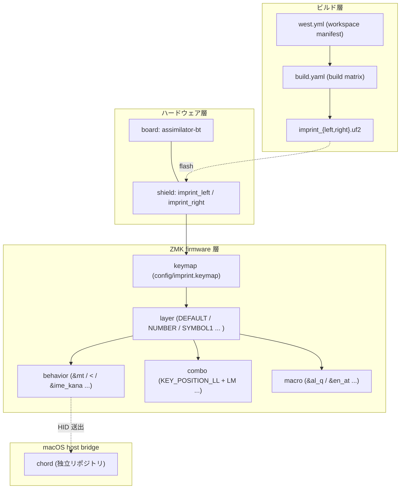

# 用語集 — canon のユビキタス言語

canon を構成する各パーツの **正規の呼び名** をまとめた規範ドキュメント。
**コード・ドキュメント・コミットメッセージ・PR タイトル・Claude Code への
プロンプト、すべてここに載っている名前のみを使う**。同義語は揺らぎを生む。
1 つに決めて、それで通す。

なお **正規名は英語のまま** 保持する。コード識別子・ZMK 設定キー
（`DEFAULT_LAYER`, `&ime_kana`, `imprint_left` など）と一対一に対応させるため。
日本語化するのは説明文だけ。

用語が足りなければ、その用語を導入する PR で同時にこのファイルへ追記する。
用語名を変える場合は、コード・ドキュメント・このファイルを **同一 PR で**
書き換える。

> 各エントリの形式: **正規名**, 1〜2 行の定義, 設定 / コードでの所在,
> そして `Don't call it:` 行 — このエントリが置き換える誤った呼び名のリスト。

---

## 全体像

下の図は canon が扱う 4 つの層と、用語がどの層に住んでいるかを示す。
レイヤーをまたぐ機能（例: `combo` が `behavior` を発火し `layer` を切替）は
複数エントリにまたがって理解する。

---

## firmware の用語

### keymap
canon の入力レイアウト全体を記述する DeviceTree 文書。
[`config/imprint.keymap`](../config/imprint.keymap) が単一エントリで、
そこから各 `*.dtsi` を `#include` する。
- **Don't call it:** layout, keyboard config, profile, レイアウト, 設定

### layer
[[keymap]] の中の 1 レイヤー（例: `DEFAULT_LAYER` / `NUMBER_LAYER` /
`SYMBOL1_LAYER` / `SYMBOL2_LAYER` / `FUNCTION_LAYER` / `LEFT_ARROW_LAYER`
など）。`display-name` で人間可読名を持ち、ZMK のレイヤースタックで
on/off される。
- 定義: [`config/layers.h`](../config/layers.h) で index、
  [`config/imprint.keymap`](../config/imprint.keymap) で内容
- **Don't call it:** mode, page, view, モード, ページ

### behavior
1 キーの動作を抽象化した ZMK の構成要素。`&mt`（mod-tap）、`&lt`（[[layer]]-tap）、
`&ime_kana` などの **アンパサンド始まり**の識別子で参照される。
- 定義: [`config/imprint_behaviors.dtsi`](../config/imprint_behaviors.dtsi),
  [`config/arrow_behaviors.dtsi`](../config/arrow_behaviors.dtsi)
- **Don't call it:** action, binding, key handler, アクション, バインド

### combo
複数キーの同時押しを 1 つの入力として解釈する ZMK の仕組み。canon では
左親指 2 キー（LL+LM）で `かな`、右親指 2 キー（RM+RR）で `英数` を
発火する `combo_kana` / `combo_eiji` がある。
- 定義: [`config/combos.dtsi`](../config/combos.dtsi)
- **Don't call it:** chord (※ macOS の `chord` ホストブリッジと衝突する),
  multi-key, simultaneous press, 同時押し, コード

### macro
複数キーストロークを順に送る ZMK の仕組み。canon の英字マクロ
（`&al_q` 等の `al_*` / `en_*` / `ar_*` 系）はこの上に乗っている。
- 定義: [`config/macros.dtsi`](../config/macros.dtsi)
- **Don't call it:** script, sequence, multi-tap, シーケンス

### EIJI layer (英字マクロ群)
日本語環境でも英字を確実に入力するためのマクロ層。
[`config/eiji_macros.dtsi`](../config/eiji_macros.dtsi) が **唯一のソース** で、
`scripts/gen-eiji-drawer-map.py` が `keymap_drawer.config.yaml` の
AUTO-GENERATED ブロックを生成、`verify-eiji-sync.yml` が CI で厳密一致を
検証する。マーカー間を手編集しない。
- **Don't call it:** ascii layer, romaji layer, 英字レイヤー（説明文中の比喩を除く）

### hold-tap
タップで A、ホールドで B というように 1 物理キーに 2 動作を持たせる
`behavior` 種別。`&mt` / `&lt` / `&ime_kana` がこれに該当。
`hold-while-undecided` を有効化済み
（[ZMK PR #1811](https://github.com/zmkfirmware/zmk/pull/1811)）。
- **Don't call it:** dual function, dual-role, タップホールド

---

## ハードウェア / ビルドの用語

### board
ZMK が指す **MCU 基板**。canon では 2 種: `assimilator-bt`（imprint、Cyboard
`zmk-keyboards@main` 由来）と `xiao_ble/nrf52840/zmk`（imprint_dongle と ist 受信
ドングル）。`assimilator-bt` はタグ固定すると `arch.cmake` が
`Could not find ARCH=cyboard` で落ちるため `@main` 追従が必須。
- 設定: [`config/west.yml`](../config/west.yml),
  [`build.yaml`](../build.yaml)
- **Don't call it:** controller, mcu board, mcu pcb（板自体を指したい時のみ
  OK だが build 文脈では `board`）

### shield
ZMK が指す **デバイス本体**（マトリクス / 物理レイアウト / 周辺）の定義。
canon の 4 シールド: imprint の `imprint_left` / `imprint_right`（分割左右）/
`imprint_dongle`、ist の `ble_hid_host_receiver`（トラックボール受信）。
- 設定: [`build.yaml`](../build.yaml)（board × shield の唯一のソース）
- 由来: `imprint_left/right`=Cyboard module、`imprint_dongle`=canon ローカル
  [`boards/shields/`](../boards/shields/)、`ble_hid_host_receiver`=自前
  `zmk-ble-hid-host` module。**ローカル shield は `imprint_dongle` のみ**
  （`boards/shields/` は空ではない）。
- **Don't call it:** half, side, panel, 分割キーボード

### west
Zephyr/ZMK の workspace 管理ツール。canon は manifest を
[`config/west.yml`](../config/west.yml) に置く（リポジトリ直下では**ない**）。
- **Don't call it:** package manager, dependency manager, パッケージマネージャ

### build target
1 つの `board × shield` 組み合わせ。canon の build target は **4 つ**（=「all」
ビルド）: `assimilator-bt × imprint_left` / `imprint_right`、
`xiao_ble/nrf52840/zmk × imprint_dongle`、`xiao_ble/nrf52840/zmk ×
ble_hid_host_receiver`（ist）。サブセット（imprint だけ / ist だけ）は
`build-zmk.sh` の shield 指定で。
- 設定: [`build.yaml`](../build.yaml)
- **Don't call it:** firmware variant, build config, ビルド構成

### `.uf2` artifact
ビルド成果物。`firmware/<shield>.uf2`（例 `imprint_left.uf2` /
`imprint_dongle.uf2` / `ble_hid_host_receiver.uf2`）を対応デバイスに書き込む。
`.gitignore` 済。
- 生成: `./scripts/build-zmk.sh`（Docker、依存は `~/.cache/zmk-canon`）
- **Don't call it:** binary, image, ファーム本体

### dtsi
DeviceTree Source Include。`#include` 経由で `keymap` に取り込まれる
部分文書。canon では `combos.dtsi` / `macros.dtsi` /
`imprint_behaviors.dtsi` / `eiji_macros.dtsi` / `arrow_behaviors.dtsi` /
`letter_morphs.dtsi` が住む。
- **Don't call it:** include file, dts fragment, ヘッダ

---

## ホスト側との接続

### host bridge
ZMK が送出するキーシーケンスを macOS 側で受けて変換する側。canon の
host bridge は本リポジトリには **存在せず**、独立リポジトリ
[`chord`](https://github.com/akira-toriyama/chord)（Swift 6 / CGEventTap
デーモン、`~/.config/chord/config.toml` 駆動）が担当する。canon は ZMK 側
（キーマップ / ファーム）のみを扱う。
- 参照: [chord リポジトリ](https://github.com/akira-toriyama/chord)
- **Don't call it:** receiver, host side, ホスト側スクリプト

### keymap-drawer
`keymap-drawer/imprint.svg` を自動生成する外部ツール
（[caksoylar/keymap-drawer](https://github.com/caksoylar/keymap-drawer)）。
`keymap_drawer.config.yaml`（リポジトリルート）が設定、`keymap-drawer/`
配下が出力。**draw-[[keymap]] の bot が生成・コミットするので手編集しない**。
- **Don't call it:** keymap visualizer, layout renderer, ビジュアライザ

---

## エントリ追加時のルール

- 1 つの概念につき正規名は 1 つ。複数の呼び方が流通しているなら、
  このファイルで勝者を選び、敗者は `Don't call it:` 行に並べる。
- 正規名は **英語のまま** 書く。ZMK 識別子（`&mt`, `MO`, `LT`,
  `DEFAULT_LAYER`）はその表記を維持する。
- 定義は **1〜2 文** に収める。動作の詳細は設定セクションやソース
  ファイルへリンクし、ここで説明し直さない。
- 用語が他リポジトリ（[chord](https://github.com/akira-toriyama/chord)
  など）と接続する場合は接続点に必ずリンクを張る。
