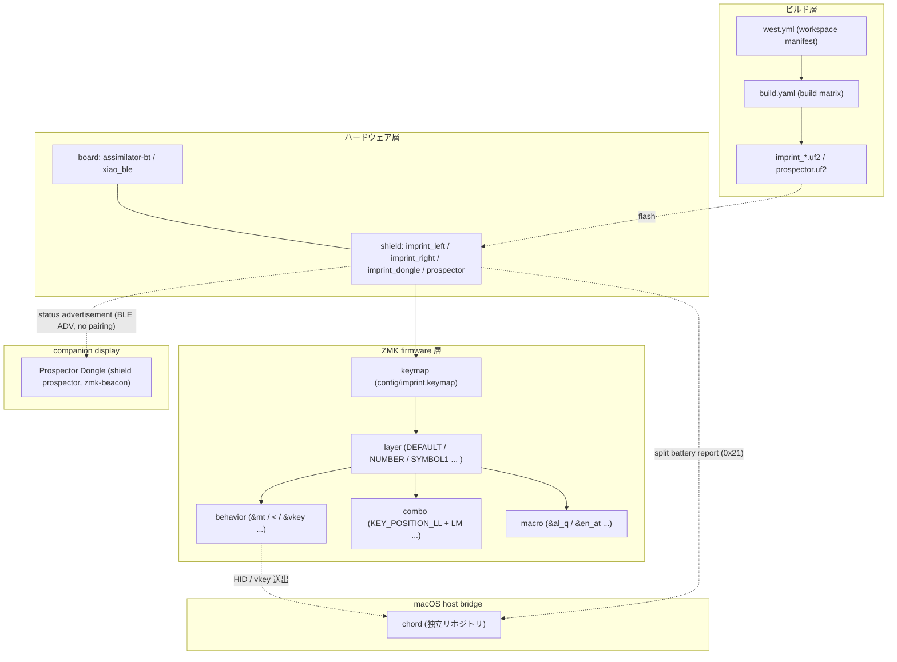

# 用語集 — canon のユビキタス言語

canon を構成する各パーツの **正規の呼び名** をまとめた規範ドキュメント。
**コード・ドキュメント・コミットメッセージ・PR タイトル・Claude Code への
プロンプト、すべてここに載っている名前のみを使う**。同義語は揺らぎを生む。
1 つに決めて、それで通す。

なお **正規名は英語のまま** 保持する。コード識別子・ZMK 設定キー
（`DEFAULT_LAYER`, `&ime_kana`, `imprint_left` など）と一対一に対応させるため。
日本語化するのは説明文だけ。

用語が足りなければ、その用語を導入する PR で同時にこのファイルへ追記する。
用語名を変える場合は、コード・ドキュメント・このファイルを **同一 PR で**
書き換える。

> 各エントリの形式: **正規名**, 1〜2 行の定義, 設定 / コードでの所在,
> そして `Don't call it:` 行 — このエントリが置き換える誤った呼び名のリスト。

---

## 全体像

下の図は canon が扱う 4 つの層と、用語がどの層に住んでいるかを示す。
レイヤーをまたぐ機能（例: `combo` が `behavior` を発火し `layer` を切替）は
複数エントリにまたがって理解する。

---

## devices

### Cyboard Imprint
The split keyboard itself: the left and right halves (board `assimilator-bt`,
shields `imprint_left` / `imprint_right`), both BLE split peripherals of the
[[Imprint Dongle]]. Product page: <https://cyboard.digital/products/imprint>.
- **Don't call it:** the keyboard, Cyboard (that is the vendor), imprint alone
  (that is the product group in `build-zmk.sh`), キーボード本体

### Imprint Dongle
The split central: a XIAO nRF52840 with shield `imprint_dongle`, bonded to both
halves over BLE and attached to the Mac as a USB HID keyboard. Its USB product
string `Imprint Dongle` is the [[host bridge]] contract (CLAUDE.md). Since
2026-09-25 it also broadcasts the [[status advertisement]] the
[[Prospector Dongle]] displays.
- Config: [`config/imprint_dongle.conf`](../config/imprint_dongle.conf),
  [`config/imprint_dongle.overlay`](../config/imprint_dongle.overlay)
- **Don't call it:** XIAO, XIAO ドングル (both dongles are XIAO nRF52840), Canon
  Dongle, receiver, central alone (that is the ZMK role, not the device)

### Prospector Dongle
The companion status display: a beekeeb pre-soldered
[Prospector](https://shop.beekeeb.com/products/pre-soldered-prospector-zmk-dongle)
(XIAO nRF52840 + Waveshare 1.69" LCD, no ambient light sensor, touch panel
unwired) running shield `prospector` from the own module
[zmk-beacon](https://github.com/akira-toriyama/zmk-beacon). A BLE observer
only: it shows both halves' battery from the [[Imprint Dongle]]'s
[[status advertisement]] and never advertises, pairs or connects (since
2026-09-26; before that it ran t-ogura's `prospector_scanner` shield). Over
USB it enumerates as one CDC ACM port with product string `Prospector Dongle`
(no HID), and opening that port at 1200 baud reboots it into the UF2
bootloader for `scripts/flash-prospector.sh` (both seen on hardware
2026-09-26). It does not replace the Imprint Dongle.
- Config: [`config/prospector.conf`](../config/prospector.conf) (canon's
  additions only); the shield's own defaults live in zmk-beacon, pinned by
  commit in [`config/west.yml`](../config/west.yml)
- **Don't call it:** XIAO, XIAO ドングル, Canon Dongle, scanner alone, Prospector
  alone in prose (the vendor's product; `prospector` is the shield), beacon
  (the module's name), second dongle, 表示ドングル

---

## firmware の用語

### keymap
canon の入力レイアウト全体を記述する DeviceTree 文書。
[`config/imprint.keymap`](../config/imprint.keymap) が単一エントリで、
そこから各 `*.dtsi` を `#include` する。
- **Don't call it:** layout, keyboard config, profile, レイアウト, 設定

### layer
[[keymap]] の中の 1 レイヤーで、ZMK のレイヤースタックで on/off される。
名前はノード名・正規名・`display-name`（短縮名）の 3 つを持つ。
- 定義: [`config/layers.h`](../config/layers.h) で index、
  [`config/imprint.keymap`](../config/imprint.keymap) で内容
- ノード名: `config/layers.h` の index マクロ。同じマクロを `config/arrow_behaviors.dtsi`・
  `config/macros.dtsi`・`config/behavior_macros.h` が使うので改名しない。
- 正規名: 文章・コミットで使う名前。単語は空白で区切り（`Symbol 1` / `Left Arrow` /
  `Vkey LL`）、ハイフン・括弧は使わない。
- `display-name`: firmware に入る短縮名で、[[keymap-drawer]] の図と [[status advertisement]]
  に出る（[[Prospector Dongle]] の画面は 2026-09-26 から layer 名を描かない）。`[A-Za-z][A-Za-z0-9]{0,3}`（英字始まりの英数字 4 文字以内）で、a-z を大文字化
  しても重複しない。理由: [[status advertisement]] は先頭 4 byte だけを運び、空の名前は
  `L<index % 10>` に置き換える。2026-09-26 まで使った t-ogura の画面（Field layout）は a-z を大文字化し、
  そのフォントは U+0020–U+007E のみ（fallback なし）。keymap-drawer は layer を名前で
  持つので同名は 1 つが黙って消え（exit 0 なので `fail_on_error` でも落ちない）、SVG の
  アンカー id は最初の ASCII 英字より前と `[A-Za-z0-9-_:.]` 以外の文字を捨てて作るので、
  記号や空白を含む別名どうしが同じ id になりうる（英数字だけなら id = 名前）。
  ソース確認 2026-09-26: prospector-zmk-module v2.2.3 `src/status_advertisement.c:798-812`、
  `boards/shields/prospector_scanner/src/field_layout.c:478-480,527-543`、
  `boards/shields/prospector_scanner/src/fonts_carrefinho/FR_Regular_36.c:2829,2889`、
  keymap-drawer 0.23.0 `keymap_drawer/parse/zmk.py:211`・`keymap_drawer/draw/utils.py:26-35`。
  2026-09-26 に keymap-drawer 0.23.0 で実測: 矢印サブレイヤーの 1 つを `Fn` と同名にすると
  exit 0・stderr 空のまま 12 layer になり Function の中身が消える。`_str_to_id` は
  `Fn!`・`Fn?`・`1Fn` をすべて `Fn` にする。
- ノード名 → 正規名 → `display-name`（矢印サブレイヤー 4 つは発動元の矢印キー
  由来で、中の送出キーの名前は使わない。Vkey 系は [[vkey]] だけを持つ親指 layer）:
  - `DEFAULT_LAYER` → Base → `Base`
  - `NUMBER_LAYER` → Number → `Num`
  - `SYMBOL1_LAYER` → Symbol 1 → `Sym1`
  - `SYMBOL2_LAYER` → Symbol 2 → `Sym2`
  - `FUNCTION_LAYER` → Function → `Fn`
  - `LEFT_ARROW_LAYER` → Left Arrow → `LArr`
  - `RIGHT_ARROW_LAYER` → Right Arrow → `RArr`
  - `UP_ARROW_LAYER` → Up Arrow → `UArr`
  - `DOWN_ARROW_LAYER` → Down Arrow → `DArr`
  - `T_LL_LAYER` → Vkey LL → `LL`
  - `T_LM_LAYER` → Vkey LM → `LM`
  - `T_RM_LAYER` → Vkey RM → `RM`
  - `T_RR_LAYER` → Vkey RR → `RR`
- **Don't call it:** mode, page, view, モード, ページ

### behavior
1 キーの動作を抽象化した ZMK の構成要素。`&mt`（mod-tap）、`&lt`（[[layer]]-tap）、
`&ime_kana` などの **アンパサンド始まり**の識別子で参照される。
- 定義: [`config/imprint_behaviors.dtsi`](../config/imprint_behaviors.dtsi),
  [`config/arrow_behaviors.dtsi`](../config/arrow_behaviors.dtsi)
- **Don't call it:** action, binding, key handler, アクション, バインド

### combo
複数キーの同時押しを 1 つの入力として解釈する ZMK の仕組み。canon では
左親指 2 キー（LL+LM）で `かな`、右親指 2 キー（RM+RR）で `英数` を
発火する `combo_kana` / `combo_eiji` がある。
- 定義: [`config/combos.dtsi`](../config/combos.dtsi)
- **Don't call it:** chord (※ macOS の `chord` ホストブリッジと衝突する),
  multi-key, simultaneous press, 同時押し, コード

### macro
複数キーストロークを順に送る ZMK の仕組み。canon の英字マクロ
（`&al_q` 等の `al_*` / `en_*` / `ar_*` 系）はこの上に乗っている。
- 定義: [`config/macros.dtsi`](../config/macros.dtsi)
- **Don't call it:** script, sequence, multi-tap, シーケンス

### EIJI layer (英字マクロ群)
日本語環境でも英字を確実に入力するためのマクロ層。
[`config/eiji_macros.dtsi`](../config/eiji_macros.dtsi) が **唯一のソース** で、
`scripts/gen-eiji-drawer-map.py` が `keymap_drawer.config.yaml` の
AUTO-GENERATED ブロックを生成、`verify-eiji-sync.yml` が CI で厳密一致を
検証する。マーカー間を手編集しない。
- **Don't call it:** ascii layer, romaji layer, 英字レイヤー（説明文中の比喩を除く）

### hold-tap
タップで A、ホールドで B というように 1 物理キーに 2 動作を持たせる
`behavior` 種別。`&mt` / `&lt` / `&ime_kana` がこれに該当。
`hold-while-undecided` を有効化済み
（[ZMK PR #1811](https://github.com/zmkfirmware/zmk/pull/1811)）。
- **Don't call it:** dual function, dual-role, タップホールド

### vkey
既存のどのキー入力とも衝突しない **オリジナルキー**（連番 id）をベンダー定義 HID
（usage page `0xFF31` / Report ID `0x20`。同 collection には [[split battery report]] の
`0x21` も同居）で送る [[behavior]]。`&vkey <id>` を press で
id・release で 0 を送り、[[host bridge]]（chord）が IOHIDManager で受けて action に
マップする。[[keymap]] は `&vkey` ノードを
[`config/vkey_behavior.dtsi`](../config/vkey_behavior.dtsi) から `#include` する。
- 単一ソース: `&vkey <id>`（[`config/imprint.keymap`](../config/imprint.keymap)）から
  [`scripts/gen-vkey-aliases.py`](../scripts/gen-vkey-aliases.py) が
  [`config/vkey-aliases.toml`](../config/vkey-aliases.toml) を生成（id 帯 `0x01` /
  `0x10`–`0x8D`。`0xA0`–`0xBF` は別製品向けに予約・canon では未使用）、
  `verify-vkey-sync.yml` が CI で照合。
- 実体: [`patches/zmk/vkey-report.patch`](../patches/zmk/vkey-report.patch)。詳細は
  [docs/vkey-roadmap.md](vkey-roadmap.md)
- **Don't call it:** custom keycode, vendor key, raw HID key, オリジナルキー（説明文中の比喩を除く）

### split battery report
[[shield]] `imprint_dongle` が左右半体の電池残量をホストへ送るベンダー定義 HID
入力レポート（usage page `0xFF31` / Report ID `0x21` / 2 byte `{source, level}`）。
`source` は split peripheral の slot index（0/1。初回ペアリング時に ZMK が空き slot へ
bond アドレスを保存し settings に永続化するので、以後は再起動・再接続でも同じ半体＝同じ
index。NVS リセットで振り直し。ソース確認 2026-09-25: `app/src/ble.c`
`zmk_ble_put_peripheral_addr()` / `central.c` `reserve_peripheral_slot()`）、
`level` は 0..100 の百分率。切断時の `0` は firmware では落とさず素通しし、
[[host bridge]]（chord）側で「切断」と「0%」を区別する。USB のみ（BLE HOG は [[vkey]] と同じく descope）。
- 実体: [`patches/zmk/vkey-report.patch`](../patches/zmk/vkey-report.patch)
  （[[vkey]] と同じ `0xFF31` collection・同じ patch。分けない理由は
  [`patches/zmk/README.md`](../patches/zmk/README.md)）。有効化は
  [`config/imprint_dongle.conf`](../config/imprint_dongle.conf) の
  `CONFIG_ZMK_SPLIT_BLE_CENTRAL_BATTERY_LEVEL_{FETCHING,HID}=y`。
- 計測: [`scripts/battery-log.py`](../scripts/battery-log.py)（`--logging` ビルドの dongle ログから残量行だけを抽出）。
- **Don't call it:** BAS, battery service, battery notification, 電池通知, 残量通知, バッテリーレポート

### status advertisement
The BLE advertisement the [[Imprint Dongle]] broadcasts for the
[[Prospector Dongle]]: a 26-byte payload in manufacturer data (active layer index
and the first 4 bytes of its `display-name`, both halves' battery levels, modifiers, WPM,
profile, connection count), carried in ZMK's scan response while ZMK advertises and as
the module's own non-connectable advertisement otherwise. Connectionless: no
pairing, no bond, no BLE slot consumed on either side.
- Producer: t-ogura `prospector-zmk-module` on the `imprint_dongle` build
  (`CONFIG_ZMK_STATUS_ADVERTISEMENT=y`, `CONFIG_ZMK_STATUS_ADV_CENTRAL_SIDE="AUX"`,
  `CONFIG_PROSPECTOR_EXPECTED_PERIPHERAL_COUNT=2` in
  [`config/imprint_dongle.conf`](../config/imprint_dongle.conf); the
  `CONFIG_COMPILER_OPT` line there is a workaround, see CLAUDE.md). Peripheral
  builds compile it out. Consumer: zmk-beacon's shield `prospector`, which
  reads only both halves' battery bytes (`src/status_observer.c` there).
- Payload layout: `include/zmk/status_advertisement.h` in the module
  (`char layer_name[4]`: only the first 4 bytes of the active [[layer]]'s name
  travel, which is why [[layer]] limits `display-name` to 4 ASCII characters).
  zmk-beacon reads it by byte offset, so a module bump re-reads the layout.
- **Don't call it:** status broadcast, beacon, telemetry, ステータス広告, 状態通知

---

## ハードウェア / ビルドの用語

### board
ZMK が指す **MCU 基板**。canon では 2 種: `assimilator-bt`（imprint、Cyboard
`zmk-keyboards@main` 由来）と `xiao_ble/nrf52840/zmk`（`imprint_dongle` と `prospector`）。
`assimilator-bt` はタグ固定すると `arch.cmake` が
`Could not find ARCH=cyboard` で落ちるため `@main` 追従が必須。
- 設定: [`config/west.yml`](../config/west.yml),
  [`build.yaml`](../build.yaml)
- **Don't call it:** controller, mcu board, mcu pcb（板自体を指したい時のみ
  OK だが build 文脈では `board`）

### shield
ZMK が指す **デバイス本体**（マトリクス / 物理レイアウト / 周辺）の定義。
canon の 4 シールド: `imprint_left` / `imprint_right`（分割左右）/ `imprint_dongle` /
`prospector`（[[Prospector Dongle]]）。
- 設定: [`build.yaml`](../build.yaml)（board × shield の唯一のソース）
- 由来: imprint の 3 シールドは Cyboard module（`zmk-keyboards` の `zephyr-4.1`
  ブランチ）、`prospector` は自前の module
  [zmk-beacon](https://github.com/akira-toriyama/zmk-beacon)（commit pin）。**canon ローカル shield は無い**（`imprint_dongle` は 2026-07-28 に
  Cyboard#19 で上流入りし、ローカル定義は撤去済み）。
- **Don't call it:** half, side, panel, 分割キーボード

### west
Zephyr/ZMK の workspace 管理ツール。canon は manifest を
[`config/west.yml`](../config/west.yml) に置く（リポジトリ直下では**ない**）。
- **Don't call it:** package manager, dependency manager, パッケージマネージャ

### build target
1 つの `board × shield` 組み合わせ。canon の build target は **4 つ**（=「all」
ビルド）: `assimilator-bt × imprint_left` / `imprint_right`、
`xiao_ble/nrf52840/zmk × imprint_dongle` / `prospector`。サブセットは
`build-zmk.sh` の shield 指定で（`imprint` グループは imprint の 3 つ、
`prospector` は単体指定）。
- 設定: [`build.yaml`](../build.yaml)
- **Don't call it:** firmware variant, build config, ビルド構成

### `.uf2` artifact
ビルド成果物。`firmware/<shield>.uf2`（例 `imprint_left.uf2` /
`imprint_dongle.uf2` / `prospector.uf2`）を対応デバイスに書き込む。
`.gitignore` 済。
- 生成: `./scripts/build-zmk.sh`（Docker、依存は `~/.cache/zmk-canon`）
- **Don't call it:** binary, image, ファーム本体

### dtsi
DeviceTree Source Include。`#include` 経由で `keymap` または
[[build target]] ごとの `*.overlay` に取り込まれる部分文書。canon では
`combos.dtsi` / `macros.dtsi` / `imprint_behaviors.dtsi` / `eiji_macros.dtsi` /
`arrow_behaviors.dtsi` / `letter_morphs.dtsi`（keymap 側）と
`ext_power_off.dtsi`（左右の overlay 側）が住む。
- **Don't call it:** include file, dts fragment, ヘッダ

---

## ホスト側との接続

### host bridge
ZMK が送出するキーシーケンスを macOS 側で受けて変換する側。canon の
host bridge は本リポジトリには **存在せず**、独立リポジトリ
[`chord`](https://github.com/akira-toriyama/chord)（Swift 6 / CGEventTap
デーモン、`~/.config/chord/config.toml` 駆動）が担当する。canon は ZMK 側
（キーマップ / ファーム）のみを扱う。
- 参照: [chord リポジトリ](https://github.com/akira-toriyama/chord)
- **Don't call it:** receiver, host side, ホスト側スクリプト

### keymap-drawer
`keymap-drawer/imprint.svg` を自動生成する外部ツール
（[caksoylar/keymap-drawer](https://github.com/caksoylar/keymap-drawer)）。
`keymap_drawer.config.yaml`（リポジトリルート）が設定、`keymap-drawer/`
配下が出力。**draw-[[keymap]] の bot が生成・コミットするので手編集しない**。
- **Don't call it:** keymap visualizer, layout renderer, ビジュアライザ

---

## エントリ追加時のルール

- 1 つの概念につき正規名は 1 つ。複数の呼び方が流通しているなら、
  このファイルで勝者を選び、敗者は `Don't call it:` 行に並べる。
- 正規名は **英語のまま** 書く。ZMK 識別子（`&mt`, `MO`, `LT`,
  `DEFAULT_LAYER`）はその表記を維持する。
- 定義は **1〜2 文** に収める。動作の詳細は設定セクションやソース
  ファイルへリンクし、ここで説明し直さない。
- 用語が他リポジトリ（[chord](https://github.com/akira-toriyama/chord)
  など）と接続する場合は接続点に必ずリンクを張る。
