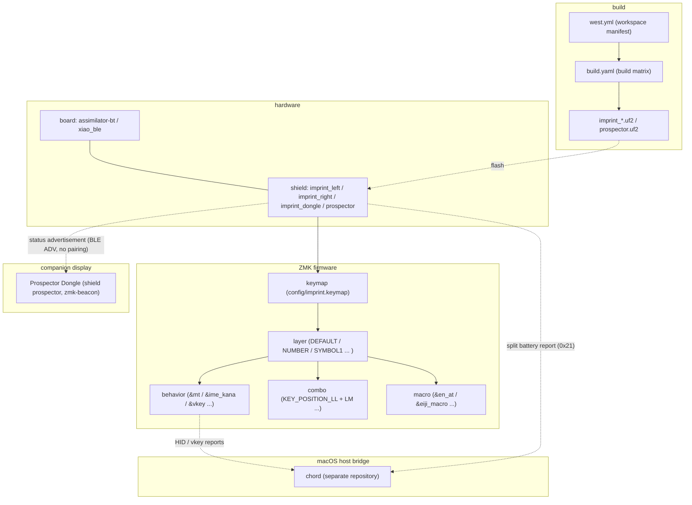

# canon ubiquitous language — Glossary

The canonical name of each part of canon. Code, docs, commit messages, PR
titles and prompts to Claude Code use only the names here: a synonym is drift.
Adding or renaming a term follows the rules at the end.

> Entry format: the canonical name, a definition of 1–2 sentences, where it
> lives in config or code, and a `Don't call it:` line listing the names the
> entry replaces.

---

## Overview

Where each term lives: the hardware, the ZMK firmware, the build, the macOS
host bridge and the companion display.

```mermaid
flowchart TB
  subgraph HW["hardware"]
    BOARD["board: assimilator-bt / xiao_ble"]
    SHIELD["shield: imprint_left / imprint_right / imprint_dongle / prospector"]
  end
  subgraph FW["ZMK firmware"]
    KEYMAP["keymap (config/imprint.keymap)"]
    LAYER["layer (DEFAULT / NUMBER / SYMBOL1 ... )"]
    BEHAVIOR["behavior (&mt / &ime_kana / &vkey ...)"]
    COMBO["combo (KEY_POSITION_LL + LM ...)"]
    MACRO["macro (&en_at / &eiji_macro ...)"]
  end
  subgraph BUILD["build"]
    WEST["west.yml (workspace manifest)"]
    BUILDYAML["build.yaml (build matrix)"]
    UF2["imprint_*.uf2 / prospector.uf2"]
  end
  subgraph HOST["macOS host bridge"]
    CHORD["chord (separate repository)"]
  end
  subgraph COMPANION["companion display"]
    PROSPECTOR["Prospector Dongle (shield prospector, zmk-beacon)"]
  end
  BOARD --- SHIELD
  SHIELD --> KEYMAP
  KEYMAP --> LAYER
  LAYER --> BEHAVIOR
  LAYER --> COMBO
  LAYER --> MACRO
  WEST --> BUILDYAML
  BUILDYAML --> UF2
  UF2 -.flash.-> SHIELD
  BEHAVIOR -.HID / vkey reports.-> CHORD
  SHIELD -.split battery report (0x21).-> CHORD
  SHIELD -.status advertisement (BLE ADV, no pairing).-> PROSPECTOR
```

---

## Devices

### Cyboard Imprint
The split keyboard: the left and right halves (board `assimilator-bt`, shields
`imprint_left` / `imprint_right`), both BLE split peripherals of the
[[Imprint Dongle]]. [Product page](https://cyboard.digital/products/imprint).
- **Don't call it:** the keyboard, Cyboard (that is the vendor), imprint alone (that is the `build-zmk.sh` group), キーボード本体

### Imprint Dongle
The split central: a XIAO nRF52840 (board `xiao_ble/nrf52840/zmk`) with shield
`imprint_dongle`, bonded to both halves over BLE and attached to the Mac as a
USB HID keyboard. Its USB product string `Imprint Dongle` is a contract with the
[[host bridge]] and `scripts/dongle.py` ([CLAUDE.md](../CLAUDE.md)), and it
broadcasts the [[status advertisement]] that the [[Prospector Dongle]] shows.
- Config: [`config/imprint_dongle.conf`](../config/imprint_dongle.conf), [`config/imprint_dongle.overlay`](../config/imprint_dongle.overlay)
- **Don't call it:** XIAO, XIAO ドングル (both dongles are XIAO nRF52840s), Canon Dongle, receiver, central alone (that is the ZMK role)

### Prospector Dongle
The companion status display: a beekeeb pre-soldered
[Prospector](https://shop.beekeeb.com/products/pre-soldered-prospector-zmk-dongle)
(XIAO nRF52840 and a Waveshare 1.69" LCD; no ambient light sensor, touch panel
unwired) running shield `prospector` of the own module
[zmk-beacon](https://github.com/akira-toriyama/zmk-beacon). A BLE observer
only: it shows both halves' battery from the [[Imprint Dongle]]'s
[[status advertisement]] and never advertises, pairs or connects, so it does
not replace the Imprint Dongle.
- USB: one CDC ACM port with product string `Prospector Dongle`, no HID. Setting the port to 1200 baud reboots it into the UF2 bootloader, which `scripts/flash-dongle.sh` uses (both seen on hardware 2026-09-26); 2400 baud sends a [[screen dump]].
- The screen turns off after five minutes without a key press on the [[Cyboard Imprint]] and lights at the next one (zmk-beacon's `CONFIG_BEACON_SCREEN_OFF_AFTER_S`, default 300; the cycle seen on hardware 2026-10-04 with a 20 s setting): a dark screen is not a dead device.
- Config: [`config/prospector.conf`](../config/prospector.conf) (canon's additions only); the shield's defaults live in zmk-beacon, pinned by commit in [`config/west.yml`](../config/west.yml)
- **Don't call it:** XIAO, XIAO ドングル, Canon Dongle, scanner alone, Prospector alone in prose (the vendor's product; `prospector` is the shield), beacon (the module's name), second dongle, 表示ドングル

---

## Firmware terms

### keymap
The DeviceTree document that gives every key on every [[layer]] its
[[behavior]]: [`config/imprint.keymap`](../config/imprint.keymap), canon's one
keymap, which `#include`s `config/behavior_macros.h` and the keymap-side
[[dtsi]] files.
- **Don't call it:** layout, keyboard config, profile, レイアウト, 設定

### layer
One layer of the [[keymap]], switched on and off in ZMK's layer stack. A layer
has three names: its node name, its canonical name and its `display-name`.
- Defined in [`config/layers.h`](../config/layers.h) (the index, in the keymap's order) and [`config/imprint.keymap`](../config/imprint.keymap) (the keys)
- Node name: the index macro in `config/layers.h`. `config/arrow_behaviors.dtsi`, `config/macros.dtsi` and `config/behavior_macros.h` use the same macros, so do not rename them.
- Canonical name: the name in prose and commits, words separated by spaces (`Symbol 1`, `Left Arrow`, `Vkey LL`), no hyphens or brackets.
- `display-name`: the short name in the firmware, shown in the [[keymap-drawer]] SVG and carried by the [[status advertisement]]. It matches `[A-Za-z][A-Za-z0-9]{0,3}` and is unique:
  - 4 ASCII characters at most: the status advertisement carries only the first 4 bytes, 0-padded (zmk-beacon `src/status_payload.h`; the Prospector Dongle does not show the name).
  - Unique: keymap-drawer keys layers by name, so a repeated name silently drops a layer, and with exit 0 `fail_on_error` does not catch it. Measured 2026-09-26 with keymap-drawer 0.23.0: one arrow sub-layer named `Fn` left 12 layers, Function's keys gone and stderr empty.
  - A letter, then letters and digits: keymap-drawer makes the SVG anchor id by turning spaces into `-` and dropping every character before the first ASCII letter or outside `[A-Za-z0-9-_:.]`, so `Fn!`, `Fn?` and `1Fn` all become `Fn`, while such a name is its own id.
  - Sources read 2026-09-26: keymap-drawer 0.23.0 `keymap_drawer/parse/zmk.py:211` and `keymap_drawer/draw/utils.py:26-35`.
- Node name → canonical name → `display-name`. The four arrow sub-layers are named after the arrow key that enters them, never after the keys they send; the Vkey layers are thumb layers that hold only [[vkey]]s.
  - `DEFAULT_LAYER` → Base → `Base`
  - `NUMBER_LAYER` → Number → `Num`
  - `SYMBOL1_LAYER` → Symbol 1 → `Sym1`
  - `SYMBOL2_LAYER` → Symbol 2 → `Sym2`
  - `FUNCTION_LAYER` → Function → `Fn`
  - `LEFT_ARROW_LAYER` → Left Arrow → `LArr`
  - `RIGHT_ARROW_LAYER` → Right Arrow → `RArr`
  - `UP_ARROW_LAYER` → Up Arrow → `UArr`
  - `DOWN_ARROW_LAYER` → Down Arrow → `DArr`
  - `T_LL_LAYER` → Vkey LL → `LL`
  - `T_LM_LAYER` → Vkey LM → `LM`
  - `T_RM_LAYER` → Vkey RM → `RM`
  - `T_RR_LAYER` → Vkey RR → `RR`
- **Don't call it:** mode, page, view, モード, ページ

### behavior
The ZMK building block for what a key does, referenced by an `&`-prefixed name
(`&kp`, `&mt`, `&mo`, `&ime_kana`, `&vkey`).
- canon's own: [`config/imprint_behaviors.dtsi`](../config/imprint_behaviors.dtsi), which includes [`config/letter_morphs.dtsi`](../config/letter_morphs.dtsi) and [`config/arrow_behaviors.dtsi`](../config/arrow_behaviors.dtsi), and the [[macro]]s of [`config/macros.dtsi`](../config/macros.dtsi); most are generated by the `#define`s in [`config/behavior_macros.h`](../config/behavior_macros.h) (`HOLD_TAP_HP200`, `ARROW_BEHAVIOR`, `LETTER_MORPH`, `EN_MACRO`, `TU_MOD`)
- **Don't call it:** action, binding, key handler, アクション, バインド

### combo
Keys pressed together that ZMK reads as one input. canon has two, each on the
lower thumb keys of one hand: `combo_kana` (LL + LM) and `combo_eiji`
(RM + RR).
- A tap switches the input source (KANA / EIJI) and a hold holds Shift+Cmd / Ctrl+Alt, through the `&ime_kana` / `&ime_eiji` [[hold-tap]]s.
- Defined in [`config/combos.dtsi`](../config/combos.dtsi)
- **Don't call it:** chord (that is the macOS host bridge), multi-key, simultaneous press, 同時押し, コード

### macro
A ZMK [[behavior]] that sends key presses and releases in order. canon's: the
`en_*` macros of the [[EIJI layer]], `eiji_macro` (the Shift side of the `al_*`
letter keys), `kana` / `eiji` (the taps of `&ime_kana` / `&ime_eiji`) and
`t_ll_ctrl` / `t_lm_alt` (upper thumb keys that hold a layer and a modifier).
- Defined in [`config/macros.dtsi`](../config/macros.dtsi)
- **Don't call it:** script, sequence, multi-tap, シーケンス

### EIJI layer
The `en_*` [[macro]]s, not a ZMK [[layer]]: each taps EIJI (`LANGUAGE_2`,
macOS's English input source key) and then holds a digit or symbol until the
key is released, so the character comes out as ASCII in any input mode.
- Single source: [`config/eiji_macros.dtsi`](../config/eiji_macros.dtsi). `scripts/gen-eiji-drawer-map.py` writes the AUTO-GENERATED block of `keymap_drawer.config.yaml` from it, and `verify-eiji-sync.yml` checks the block in CI: never edit between the markers.
- **Don't call it:** ascii layer, romaji layer, 英字レイヤー (fine as a figure of speech in prose)

### hold-tap
A [[behavior]] type that gives one key one meaning on tap and another on hold.
canon's: `&mt` (the lower thumb keys), `&ime_kana` / `&ime_eiji` (the
[[combo]]s; hold-preferred, 200 ms) and the arrow keys' `ar_*_ht`.
- `&mt` and the arrow hold-taps set `hold-while-undecided` ([zmkfirmware/zmk#1811](https://github.com/zmkfirmware/zmk/pull/1811)).
- Defined in [`config/behavior_macros.h`](../config/behavior_macros.h) (`HOLD_TAP_HP200`, `ARROW_BEHAVIOR`); the `&mt` setting is in [`config/imprint.keymap`](../config/imprint.keymap)
- **Don't call it:** dual function, dual-role, タップホールド

### vkey
An original key that collides with no other key input: the [[behavior]]
`&vkey <id>` sends the id in a vendor-defined HID report (usage page `0xFF31`,
Report ID `0x20`; the [[split battery report]]'s `0x21` shares the collection),
the id on press and 0 on release. The [[host bridge]] chord reads it with
IOHIDManager and maps the id to one of its actions.
- The [[keymap]]'s `&vkey` node is in [`config/imprint_behaviors.dtsi`](../config/imprint_behaviors.dtsi).
- Single source: the `&vkey <id>` keys of [`config/imprint.keymap`](../config/imprint.keymap). [`scripts/gen-vkey-aliases.py`](../scripts/gen-vkey-aliases.py) generates [`config/vkey-aliases.toml`](../config/vkey-aliases.toml) for chord from them, and `verify-vkey-sync.yml` checks it in CI. Ids: `0x01` and one 30-id block per Vkey layer (`0x10`–`0x2D`, `0x30`–`0x4D`, `0x50`–`0x6D`, `0x70`–`0x8D`), and `decode()` refuses any other id; `0xA0`–`0xBF` is reserved for the ist dongle of another repository, since chord maps ids in one namespace per host.
- Implementation: [`patches/zmk/vkey-report.patch`](../patches/zmk/vkey-report.patch), USB only. The patch, its upstream PR and the vkey design notes: [`patches/zmk/README.md`](../patches/zmk/README.md)
- **Don't call it:** custom keycode, vendor key, raw HID key, オリジナルキー (fine as a figure of speech in prose)

### split battery report
The vendor-defined HID input report in which the [[Imprint Dongle]] sends each
half's battery level to the host: usage page `0xFF31`, Report ID `0x21`,
2 bytes `{source, level}`, USB only (BLE HOG descoped, as for [[vkey]]).
- `source`: the split peripheral's slot index, 0 or 1, which a half keeps through reboots and reconnects until an NVS reset (how a half gets its slot and which half holds which: [docs/recovery.md](recovery.md#slot-order)).
- `level`: 0..100 percent. The `0` that ZMK raises when a half disconnects passes through unfiltered; the [[host bridge]] (chord), not the firmware, tells a disconnect from 0 %.
- Implementation: [`patches/zmk/vkey-report.patch`](../patches/zmk/vkey-report.patch), the same `0xFF31` collection and the same patch as [[vkey]] (why one patch: [`patches/zmk/README.md`](../patches/zmk/README.md)). Enabled by `CONFIG_ZMK_SPLIT_BLE_CENTRAL_BATTERY_LEVEL_{FETCHING,HID}=y` in [`config/imprint_dongle.conf`](../config/imprint_dongle.conf).
- Measuring: [CLAUDE.md](../CLAUDE.md), Debugging and device operations.
- **Don't call it:** BAS, battery service, battery notification, 電池通知, 残量通知, バッテリーレポート

### status advertisement
The BLE advertisement the [[Imprint Dongle]] broadcasts for the
[[Prospector Dongle]]: 26 bytes of manufacturer data (each half's battery
level, the highest active [[layer]]'s index and the first 4 bytes of its
`display-name`, and a count of key presses) on a second, non-connectable
advertising set next to ZMK's own, every 200 ms; no pairing, no bond, no BLE
slot on either side. Both ends and the byte layout are zmk-beacon's
([`src/status_payload.h`](https://github.com/akira-toriyama/zmk-beacon/blob/main/src/status_payload.h)).
- Enabled by `CONFIG_BEACON_STATUS_BROADCAST=y` and `CONFIG_BT_EXT_ADV_MAX_ADV_SET=2` in [`config/imprint_dongle.conf`](../config/imprint_dongle.conf) (why the second line: the comment there); the halves' builds do not have it.
- **Don't call it:** status broadcast, beacon, telemetry, ステータス広告, 状態通知

### sprite
The animated GIF a [[Prospector Dongle]] build can play above the [[HP bar]]
(zmk-beacon's `CONFIG_BEACON_SPRITE_GIF`; size, tempo, key-press stepping and
limits: [zmk-beacon's README](https://github.com/akira-toriyama/zmk-beacon#the-sprite)).
The GIF is a personal file: built only locally with
`./scripts/build-zmk.sh prospector --sprite <gif>` into
`firmware/prospector-sprite.uf2`, never committed and never in CI or a release
([`assets/README.md`](../assets/README.md)).
- **Don't call it:** mascot, pet, avatar, character, GIF alone (that is the file), スプライト画像

### sprite name
The text under the [[HP bar]] in a [[sprite]] build: the GIF's file name with
the extension dropped, whitespace trimmed and the first letter upper-cased
([`assets/sprite-name.sh`](../assets/sprite-name.sh)), which
`build-zmk.sh --sprite` passes to zmk-beacon as
[`CONFIG_BEACON_SPRITE_NAME`](https://github.com/akira-toriyama/zmk-beacon/blob/main/Kconfig).
It names the GIF's subject, so it never appears in commits, PRs or docs; the
CI / release build has none and shows no name row.
- **Don't call it:** caption, label, title, character name, キャラ名, 名札

### HP bar
The [[Prospector Dongle]]'s battery reading in a box along the bottom of the
screen: `HP` and a battle-screen style bar with its value on it (`65/100`),
the bar as long as the mean of both halves' levels, or the one half that has
a reading ([zmk-beacon's README](https://github.com/akira-toriyama/zmk-beacon#the-screen)).
In a [[sprite]] build the box has a second row with the [[sprite name]].
- **Don't call it:** battery bar, life bar, health bar, gauge, HP ゲージ, 体力バー

### screen dump
The [[Prospector Dongle]]'s screen, sent over its USB serial port when the host
sets the port to 2400 baud (zmk-beacon's `CONFIG_BEACON_SCREEN_DUMP`, on by
default in the `prospector` shield; record format:
[`src/screen_dump.c`](https://github.com/akira-toriyama/zmk-beacon/blob/main/src/screen_dump.c)).
`python3 scripts/dongle.py shot` turns it into a PNG and refuses an `--out`
path inside any git work tree.
- A [[sprite]] build's PNG shows the sprite and its [[sprite name]]: it never goes into a commit, a PR or an issue.
- **Don't call it:** screen capture, screenshot, framebuffer dump, snapshot (that is LVGL's `lv_snapshot`), 画面キャプチャ, スクショ

---

## Hardware and build terms

### board
The MCU's circuit board as ZMK and Zephyr define it; a [[build target]] pairs
one with a [[shield]]. canon has two: `assimilator-bt` (the [[Cyboard Imprint]]'s
halves, from Cyboard's `zmk-keyboards` on its `zephyr-4.1` branch) and
`xiao_ble/nrf52840/zmk` (`imprint_dongle` and `prospector`).
- `assimilator-bt` is a hardware-model-v2 board, which is why ZMK follows `main` rather than a tag and `zmk-keyboards` follows `zephyr-4.1` rather than `main`: the comments in [`config/west.yml`](../config/west.yml)
- Config: [`config/west.yml`](../config/west.yml), [`build.yaml`](../build.yaml)
- **Don't call it:** controller, mcu board, mcu pcb (only for the physical PCB; in a build context say `board`)

### shield
What ZMK builds on top of a [[board]]: the device's matrix, physical layout and
peripherals. canon's four: `imprint_left` / `imprint_right` (the halves),
`imprint_dongle` (the [[Imprint Dongle]]) and `prospector` (the
[[Prospector Dongle]]).
- Config: [`build.yaml`](../build.yaml), the single source of board × shield
- Origin: the three imprint shields come from the Cyboard module (`zmk-keyboards`, `zephyr-4.1` branch), `prospector` from the own module zmk-beacon (pinned by commit). canon has no local shield: `imprint_dongle` went upstream with [Cyboard-DigitalTailor/zmk-keyboards#19](https://github.com/Cyboard-DigitalTailor/zmk-keyboards/pull/19) on 2026-07-28 and the local copy was removed.
- **Don't call it:** half, side, panel, 分割キーボード

### west
The Zephyr / ZMK workspace tool. canon's manifest is
[`config/west.yml`](../config/west.yml), not a file at the repository root.
- **Don't call it:** package manager, dependency manager, パッケージマネージャ

### build target
One `board × shield` pair. canon has four, the "all" build:
`assimilator-bt × imprint_left` / `imprint_right` and
`xiao_ble/nrf52840/zmk × imprint_dongle` / `prospector`. `build-zmk.sh` takes
a subset by shield name or group (`imprint`: the three imprint shields;
`prospector` alone).
- Config: [`build.yaml`](../build.yaml)
- **Don't call it:** firmware variant, build config, ビルド構成

### image
A built firmware file, `firmware/<shield>.uf2` (`imprint_left.uf2`,
`imprint_right.uf2`, `imprint_dongle.uf2`, `prospector.uf2`), which flashes a
device when copied onto its UF2 bootloader volume; `firmware/` is git-ignored.
Option builds add a suffix to the name (`prospector-sprite.uf2`,
`imprint_dongle-logging.uf2`; the scheme is in the header of
`scripts/build-zmk.sh`).
- Built by `./scripts/build-zmk.sh` (Docker, workspace `~/.cache/zmk-canon`); CI builds the same four, and the release draft attaches them.
- The container the build runs in is the Docker image (`ZMK_IMAGE`, `zmkfirmware/zmk-build-arm`), never "image" alone.
- **Don't call it:** binary, uf2 artifact (an artifact is the zip a CI run uploads), ファーム本体

### dtsi
DeviceTree Source Include: a partial DeviceTree source that the [[keymap]] or a
[[build target]]'s `*.overlay` pulls in with `#include`. canon's are
`combos.dtsi`, `macros.dtsi`, `imprint_behaviors.dtsi`, `eiji_macros.dtsi`,
`arrow_behaviors.dtsi` and `letter_morphs.dtsi` on the keymap side, and
`ext_power_off.dtsi` in both halves' overlays.
- **Don't call it:** include file, dts fragment, ヘッダ

---

## Outside the firmware

### host bridge
The macOS program that acts on what the firmware sends:
[chord](https://github.com/akira-toriyama/chord), a separate repository (a
Swift 6 daemon on CGEventTap, driven by `~/.config/chord/config.toml`). It
reads the [[vkey]] and [[split battery report]]s from the [[Imprint Dongle]],
which it finds by USB product string; canon holds only the ZMK side.
- **Don't call it:** receiver, host side, ホスト側スクリプト

### keymap-drawer
The external tool
([caksoylar/keymap-drawer](https://github.com/caksoylar/keymap-drawer)) that
draws the [[keymap]] as `keymap-drawer/imprint.svg` (with
`keymap-drawer/imprint.yaml`), configured by `keymap_drawer.config.yaml` at the
repository root. The Draw keymap workflow
([`.github/workflows/draw-keymap.yml`](../.github/workflows/draw-keymap.yml),
keymap-drawer 0.23.0) generates and commits `keymap-drawer/`: never edit it by
hand.
- **Don't call it:** keymap visualizer, layout renderer, ビジュアライザ

---

## Rules for entries

- One canonical name per concept. When several names circulate, pick the winner here and list the others on its `Don't call it:` line.
- A canonical name is spelled as in the code: ZMK identifiers keep their form (`&mt`, `&mo`, `DEFAULT_LAYER`, `imprint_left`).
- A definition is 1–2 sentences; link to the config or source for behavior instead of restating it.
- Where a term meets another repository ([chord](https://github.com/akira-toriyama/chord), [zmk-beacon](https://github.com/akira-toriyama/zmk-beacon)), link to the meeting point.
- A new term goes into this file in the PR that introduces it; rename a term in code, docs and this file in the same PR.
- The glossary site builds from this file (`.github/workflows/glossary.yml` → akira-toriyama/glossary-site): one H1, H2 sections, H3 entries, wikilinks to H3 terms. Its renderer ends a list item at the line end, so a bullet stays on one line; it splits a `Don't call it:` line into aliases at every `,` and `、`, so a note inside an alias has no comma; and in an entry it reads a `#` after a space as a tag.
